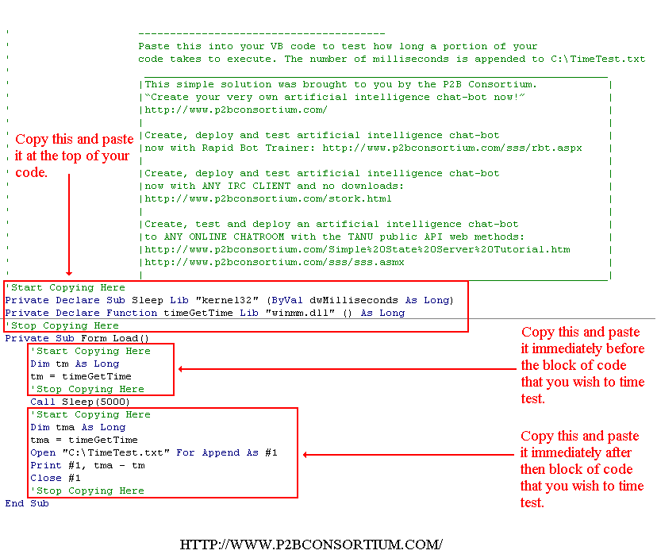

<div align="center">

## \[ A Simple\] code execution speed test


</div>

### Description

Paste this into your VB code to test how long a portion of your code takes to execute. The number of milliseconds is appended to C:\TimeTest.txt
 
### More Info
 


<span>             |<span>
---                |---
**Submitted On**   |
**By**             |[lonetron](https://github.com/Planet-Source-Code/PSCIndex/blob/master/ByAuthor/lonetron.md)
**Level**          |Advanced
**User Rating**    |4.7 (14 globes from 3 users)
**Compatibility**  |VB 5\.0, VB 6\.0, VB Script, ASP \(Active Server Pages\) , VBA MS Access, VBA MS Excel
**Category**       |[Complete Applications](https://github.com/Planet-Source-Code/PSCIndex/blob/master/ByCategory/complete-applications__1-27.md)
**World**          |[Visual Basic](https://github.com/Planet-Source-Code/PSCIndex/blob/master/ByWorld/visual-basic.md)
**Archive File**   |[](https://github.com/Planet-Source-Code/lonetron-a-simple-code-execution-speed-test__1-49159/archive/master.zip)

### API Declarations

```
Private Declare Sub Sleep Lib "kernel32" (ByVal dwMilliseconds As Long)
Private Declare Function timeGetTime Lib "winmm.dll" () As Long
```


### Source Code

```
'---------------------------------------
'[Simple] code execution time tests for VB
'---------------------------------------
'Paste this into your VB code to test how long a portion of your
'code takes to execute. The number of milliseconds is appended to C:\TimeTest.txt
' __________________________
'|This simple solution was
'|brought to you by the P2B Consortium.
'|“Create your very own artificial
'|intelligence chat-bot now!”
'|http://www.p2bconsortium.com/sss/CreateBot.aspx
'|__________________________
'Start Copying Here
Private Declare Sub Sleep Lib "kernel32" (ByVal dwMilliseconds As Long)
Private Declare Function timeGetTime Lib "winmm.dll" () As Long
'Stop Copying Here
Private Sub Form_Load()
 'Start Copying Here
 Dim tm As Long
 tm = timeGetTime
 'Stop Copying Here
 Call Sleep(5000)
 'Start Copying Here
 Dim tma As Long
 tma = timeGetTime
 Open "C:\TimeTest.txt" For Append As #1
 Print #1, tma - tm
 Close #1
 'Stop Copying Here
End Sub
```

